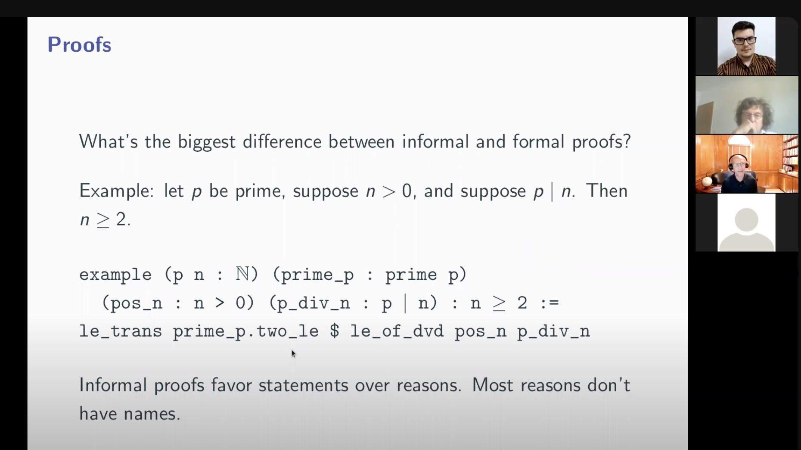

# advantage over lean
we don't need to explicity name everything

The video you linked 1 argues for a mathematical language rooted in concepts and reasoning, rather than formal systems. This aligns well with the overall goal of this project, which is to make deriving mathematical expressions safe and intuitive. The question is how to incorporate "math stories" and make formalization effortless. Here's a breakdown of how a high-level math system can achieve this:
1. Building Blocks Based on Concepts, Not Axioms:
Intuitive Data Structures: Instead of starting with low-level axioms (like ZFC set theory), the system should define mathematical objects in ways that mirror how mathematicians think about them. For example, a Group in our Rust code is defined by a base_set and an operation, along with properties like Abelian or Finite. This is much closer to the conceptual understanding of a group than a purely axiomatic definition.
Rich Type System: A powerful type system can capture the relationships between mathematical objects. For instance, we could have types like TopologicalSpace, Manifold, VectorSpace, and LieGroup. The type system can enforce that certain operations are only valid for specific types (e.g., you can only take the inverse of a matrix within a LieGroup if it satisfies certain properties). This is reflected in our use of enums like GroupProperty, TopologicalGroupProperty, and LieGroupProperty.
Operations as Methods: Mathematical operations (like addition, multiplication, differentiation, integration) should be implemented as methods associated with the relevant types. This makes the code read more like a mathematical description. For example, group.operation.apply(element1, element2) is more intuitive than some abstract function operating on sets.
2. "Storytelling" with Intermediate Steps:
Derivation as a Sequence of Transformations: A mathematical proof or derivation isn't just a single jump from premises to conclusion. It's a story of how we get there. The system should allow users to express these intermediate steps explicitly. This is where the derive module in our project comes in. Modules like rearrange, simplify, and substitute represent different kinds of reasoning steps.
Human-Readable Explanations: Each step in a derivation should be associated with a human-readable explanation. This could be a simple comment (as you've emphasized throughout our interaction) or a more structured explanation referencing a known theorem or lemma. The explain module in our project is intended for this purpose.
Interactive Exploration: The system should allow users to explore different derivation paths. This is similar to how a mathematician might try different approaches on a piece of paper before settling on a final proof. This could involve features like "undo/redo" and branching derivation paths.
3. Formalization as a Byproduct, Not the Goal:
Type Checking as Verification: The primary way to ensure correctness should be through the type system. If the code compiles and the types align, it's a strong indication that the derivation is valid. This is much more immediate and intuitive than trying to construct a formal proof from scratch.
Automated Theorem Proving (Optional): For more complex derivations, the system could incorporate automated theorem proving techniques. However, this should be seen as an aid to the user, not a requirement. The user should always be able to understand the reasoning behind a derivation, even if some steps are automated.
Formalization on Demand: The system could provide a way to "export" a derivation in a formal language (like Lean, Coq, or Isabelle) if desired. But this should be an optional step, primarily for users who need the highest level of rigor or want to interact with existing formal libraries.
Example (Illustrative):
Imagine a user wants to show that the derivative of sin(x) is cos(x). The "math story" might look like this:
Start with the definition of the derivative: lim (h->0) [sin(x+h) - sin(x)] / h
Apply the trigonometric identity: sin(x+h) = sin(x)cos(h) + cos(x)sin(h)
Substitute and simplify: lim (h->0) [sin(x)cos(h) + cos(x)sin(h) - sin(x)] / h
= lim (h->0) [sin(x)(cos(h)-1) + cos(x)sin(h)] / h
= sin(x) * lim (h->0) (cos(h)-1)/h + cos(x) * lim (h->0) sin(h)/h
Use known limits: lim (h->0) (cos(h)-1)/h = 0 and lim (h->0) sin(h)/h = 1
Conclude: sin(x) * 0 + cos(x) * 1 = cos(x)
In our system, each of these steps would be represented by a code transformation, with associated explanations. The type system would ensure that each transformation is valid. The final result would be both a human-readable derivation and (potentially) a formal proof.
In summary, the key is to design the system around mathematical thinking, not mathematical formalism. Formalism becomes a tool to support and verify the reasoning, not the primary mode of interaction. The current structure of the project, with its emphasis on types, operations, and derivation steps, is a good foundation for this approach. The display, derive, and formalize modules are all crucial for bridging the gap between intuitive mathematical reasoning and rigorous formal verification.